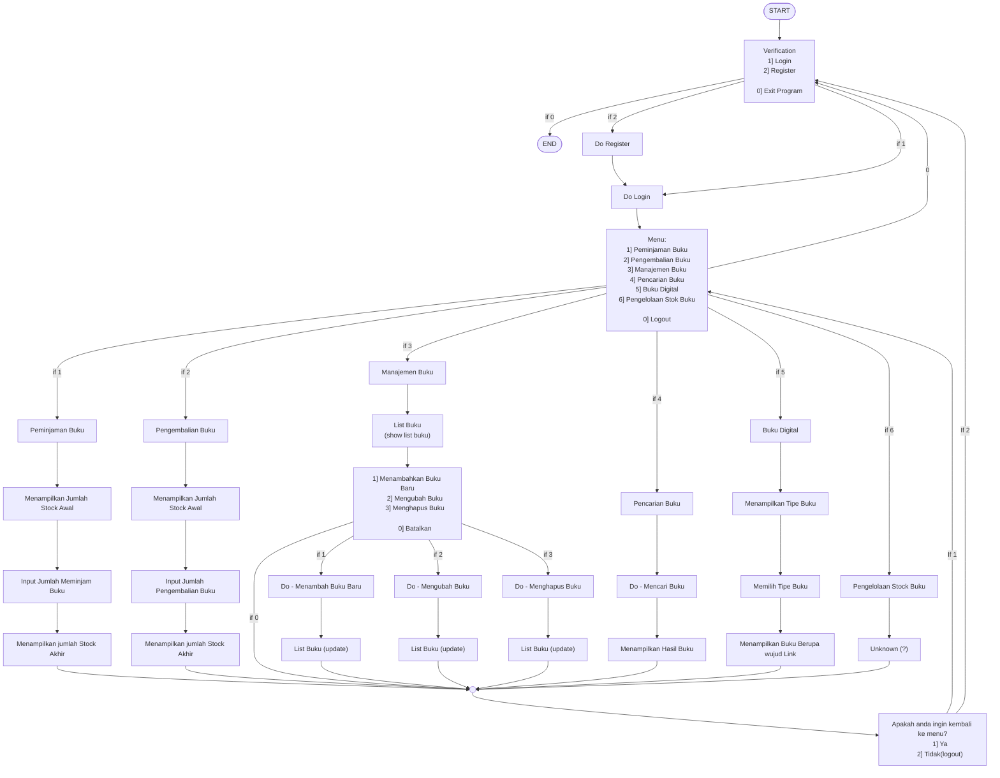

# Flowchart - Sistem Peminjaman [Perpustakaan] 

 

## Team:
- Akhmad Aakhif Athallah
- Danendra Nayaka Passadhi
- Muhammad Dhia Ramadhanil Haq

### [⬅️Back to Repo](../../)

 

## 🗺️Flowchart

 
 
 

<h1 align="center">
    <a href="#top">⏏️Back to Top</a>
</h1>
